# Learning OpenCV

This is just the short documentation on OpenCV for my own reading convenience.

### Reading Images and Videos

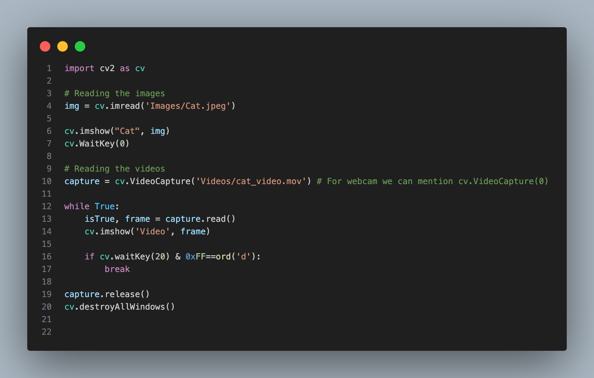
 
### Rescaling Images and Videos

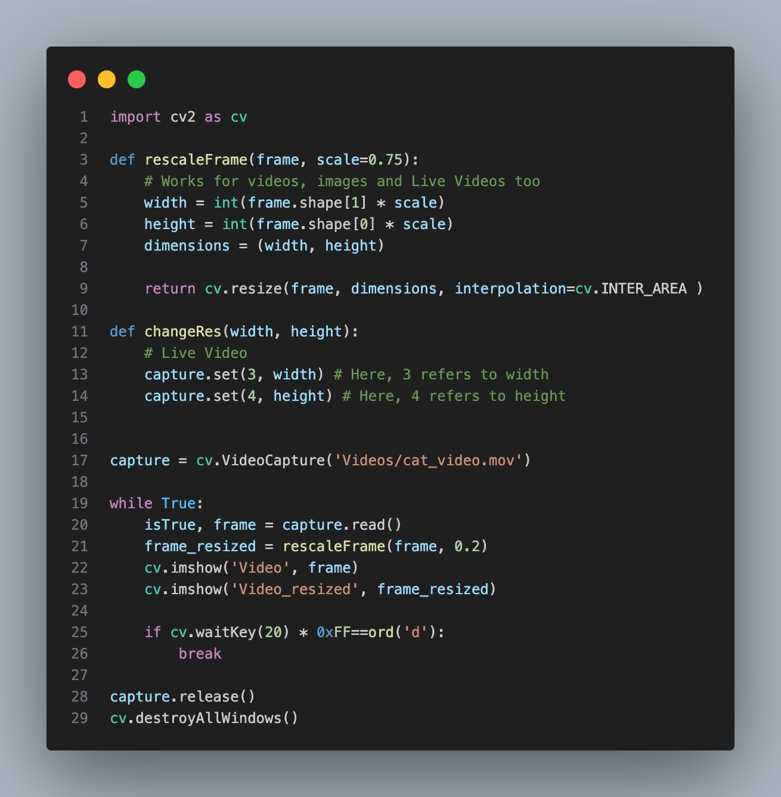

### Drawing Shapes

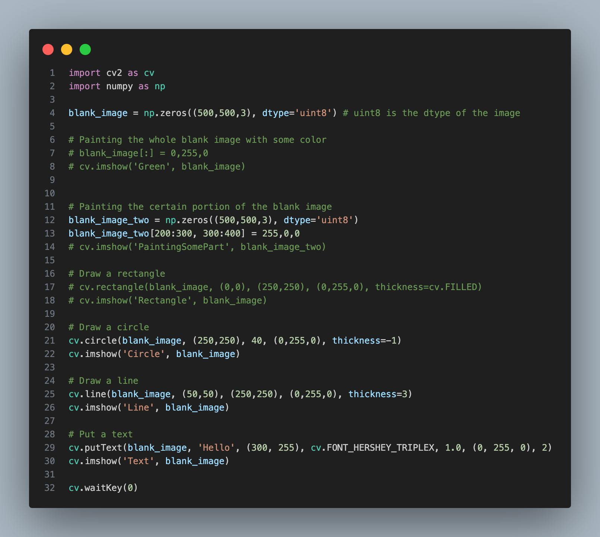

### Basic Functions

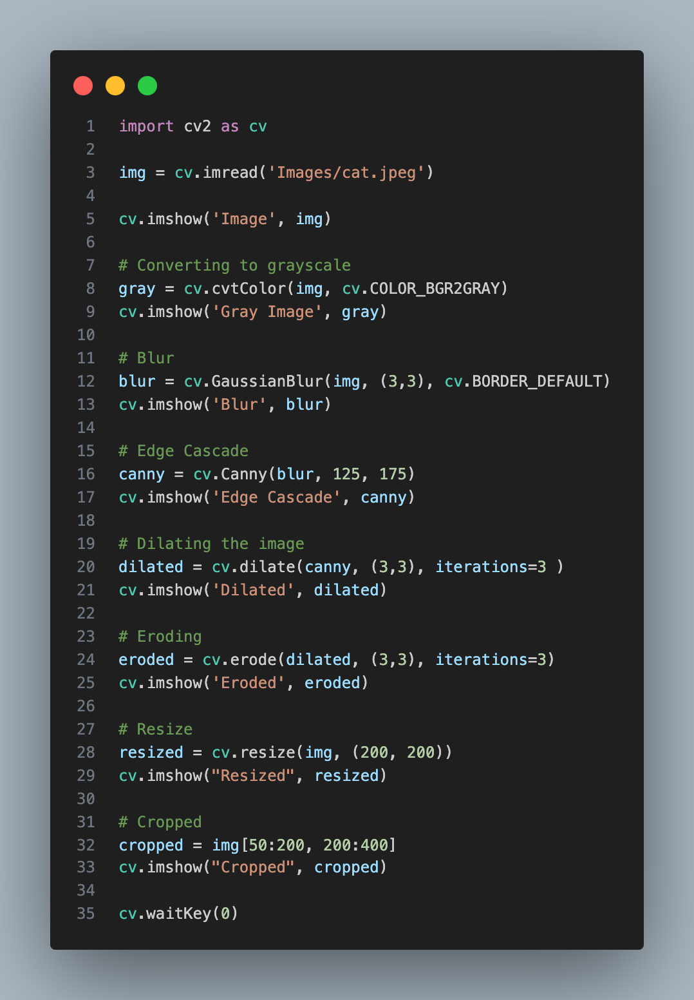

### Transformations In OpenCV

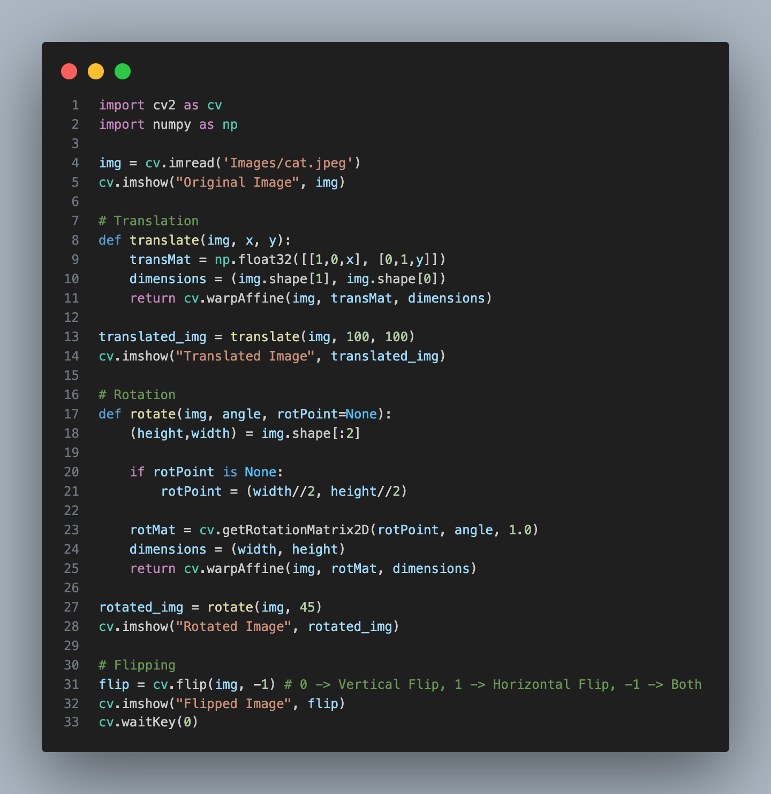

### Contours In OpenCV

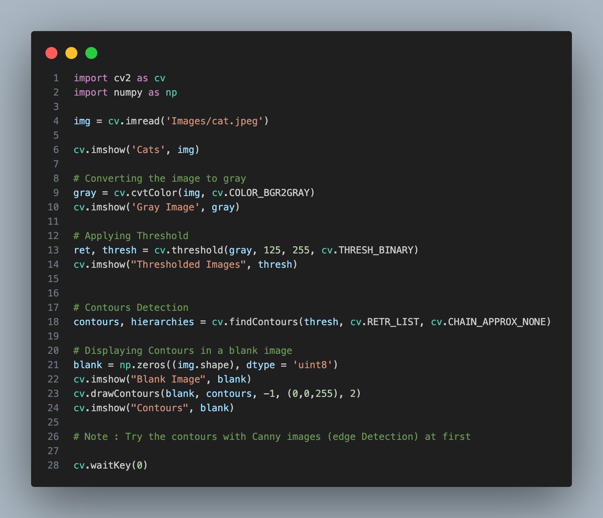

### Color Spaces

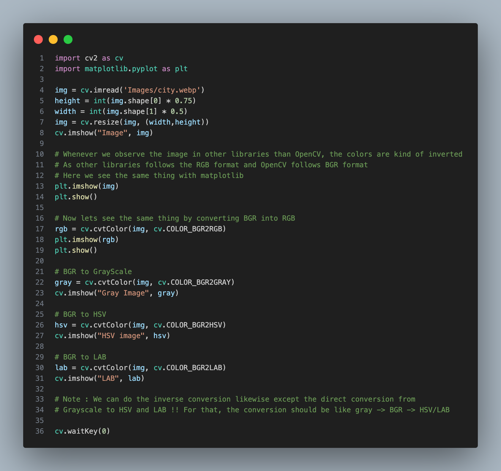

### Splitting And Merging Color Channels

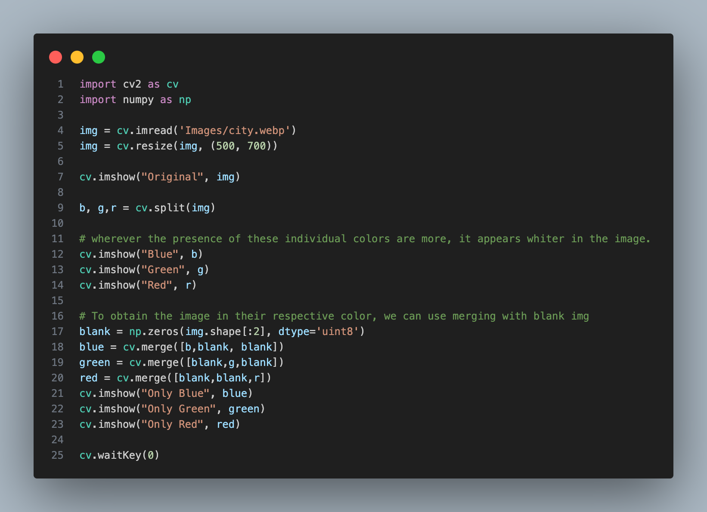

### Blurring

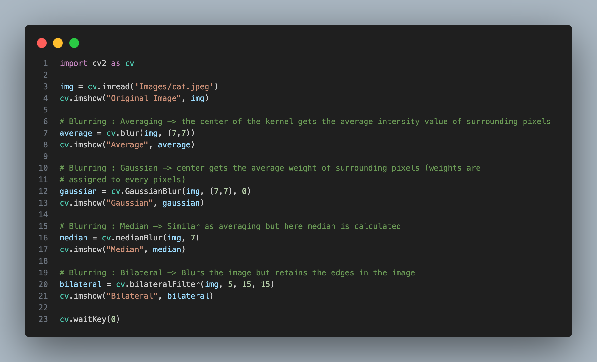

### Bitwise Operations

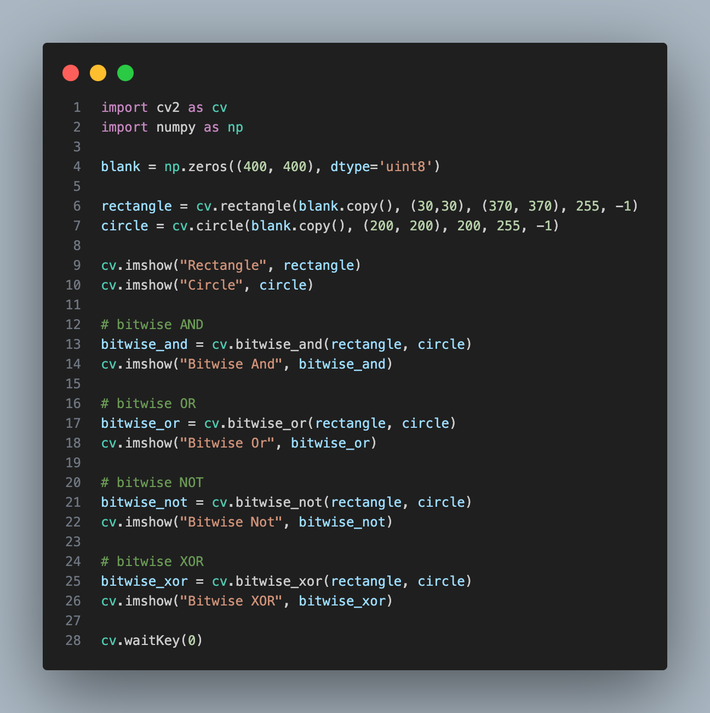

### Masking

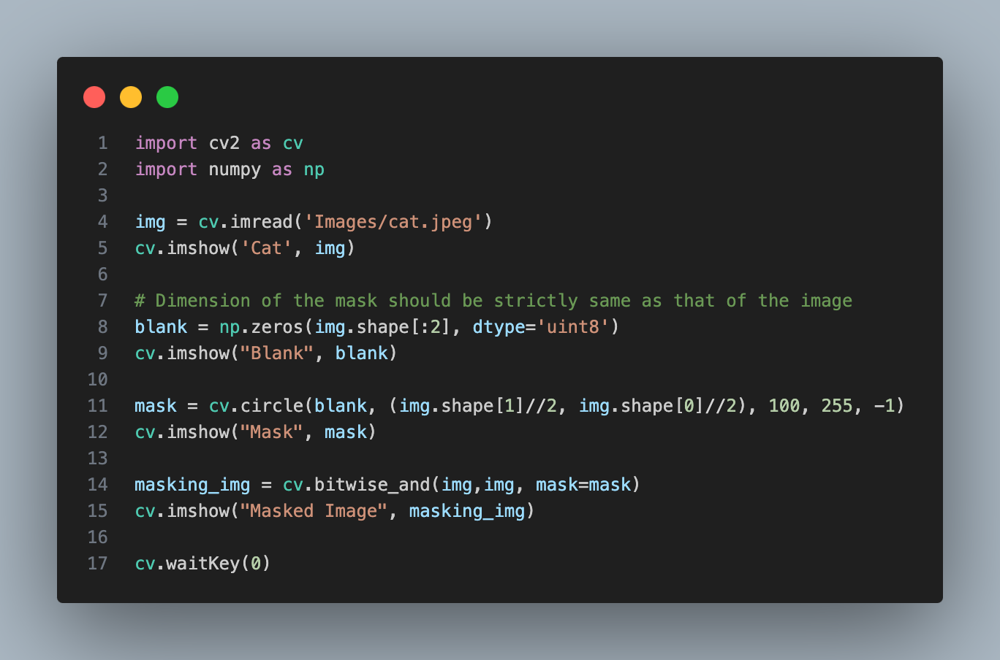
